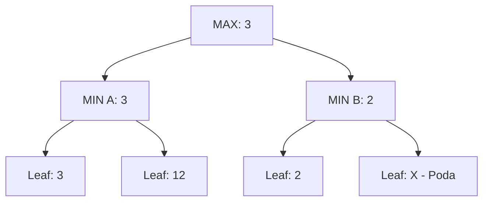

# IA - Relación 3: Juegos y Búsqueda Adversaria (Oficial UHU)

## 🧠 IA que Juega (Ajedrez, 3 en raya...)
En estos problemas no estamos solos, hay un "enemigo" que quiere fastidiarnos. Por eso usamos algoritmos de Minimax.

*   **Minimax**: Yo quiero MAXimizar mi beneficio, el rival quiere MINimizarlo.
*   **Poda Alfa-Beta**: Permite ignorar ramas que no afectan al resultado final.

## 📝 Ejercicio Resuelto: Árbol Minimax con Poda
A continuación se visualiza el proceso de toma de decisiones en un árbol de profundidad 2.

**Análisis**:
1. El primer hijo de MIN A es 3. El segundo es 12. MIN A elige el menor: **3**.
2. El primer hijo de MIN B es 2. Como MAX ya tiene garantizado un 3 (vía MIN A), y sabe que MIN B elegirá "como mucho un 2" (porque 2 es menor que 3), MAX ya no necesita mirar el resto de hijos de MIN B.
3. Se produce una **Poda Alfa-Beta** en el nodo H4.

## 📝 Heurísticas en Juegos
¿Cómo evaluarías una partida de Damas a mitad de juego?
- **Material**: Diferencia de piezas (Peones: 1, Reinas: 3).
- **Posición**: Control del centro y avance de peones.
- **Movilidad**: Número de movimientos legales disponibles (evitar bloqueos).
