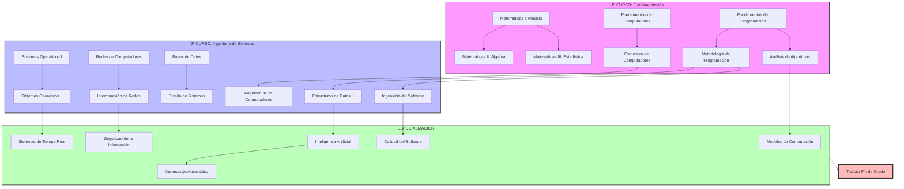

# Mapa Curricular: Itinerario de Conocimiento (ETSI UHU)

Este diagrama visualiza la progresión lógica de los conocimientos a lo largo del grado, destacando las dependencias críticas entre materias.

## 🚩 Hitos Críticos (Dependencias)
1. **El Núcleo de Programación**: FP $\to$ MP $\to$ ED II. Perder el hilo en cualquiera de estas asignaturas compromete todo el desarrollo de software posterior.
2. **La Pila de Sistemas**: FC $\to$ EC $\to$ AC. Define tu capacidad de entender el rendimiento real del hardware.
3. **La Red de Seguridad**: FRC $\to$ IRC $\to$ Seguridad. El camino hacia el PenTesting clínico.

---
*Gráfico de Dependencias - Ingeniería Informática UHU.*
